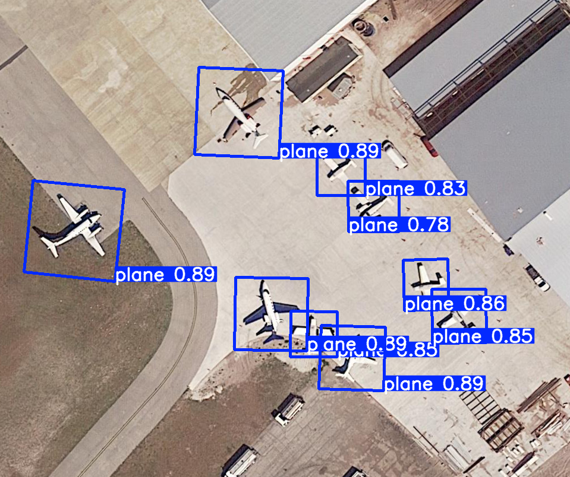

# 🛰️ Satellite Object Detection with YOLOv1-OBB

This project focuses on detecting objects in satellite images using a custom-trained YOLOv11 model with Oriented Bounding Boxes (OBB). The model has been fine-tuned on satellite imagery data and is capable of predicting both the location and orientation of detected objects.

## 🧾 Detected Classes

The model is trained to detect the following 15 object types commonly found in aerial or satellite imagery:

- `plane`
- `ship`
- `storage-tank`
- `baseball-diamond`
- `tennis-court`
- `basketball-court`
- `ground-track-field`
- `harbor`
- `bridge`
- `large-vehicle`
- `small-vehicle`
- `helicopter`
- `roundabout`
- `soccer-ball-field`
- `swimming-pool`

These are defined in your `names` list and matched to class indices in model outputs (via `box.cls` in inference).

---

## 🚀 Installation

1. Clone this repository:
   ```bash
   git clone https://github.com/yourusername/Satelite-Detection.git
   cd Satelite-Detection
   ```

2. Install required Python packages:
   ```bash
   pip install -r requirements.txt
   ```
   Or, for Jupyter Notebook:
   ```bash
   pip install ultralytics opencv-python matplotlib numpy
   ```

---

## 📦 Dataset Preparation

- Place your satellite images in `./dataset/images/train` and `./dataset/images/valid`.
- Place the corresponding label `.txt` files in `./dataset/labels_start/train` and `./dataset/labels_start/valid`.
- The notebook will convert and normalize the labels for YOLO OBB format.

---

## 🏃 Usage

Open `Main.ipynb` in Jupyter Notebook or VS Code and run the cells step by step:

1. **Label Conversion:** Converts raw labels to YOLO OBB format.
2. **Training:** Trains the YOLOv11-OBB model on your dataset.
3. **Testing:** Runs inference on a sample image and saves the result as `predicted_output.png`.

---

## 🖼️ Example Output



```text
Speed: 6.7ms preprocess, 155.8ms inference, 16.6ms postprocess per image at shape (1, 3, 544, 640)

OBB 0: Center=(592.8, 603.5), Size=(108.6, 107.5), Angle=0.0, Confidence=0.89, Class=plane
OBB 1: Center=(401.9, 189.9), Size=(142.0, 147.4), Angle=0.0, Confidence=0.89, Class=plane
OBB 2: Center=(456.5, 529.4), Size=(121.9, 121.6), Angle=0.0, Confidence=0.89, Class=plane
OBB 3: Center=(124.9, 389.2), Size=(154.1, 155.5), Angle=0.1, Confidence=0.89, Class=plane
OBB 4: Center=(716.8, 479.7), Size=(85.2, 74.7), Angle=1.5, Confidence=0.86, Class=plane
OBB 5: Center=(772.5, 532.8), Size=(90.6, 90.4), Angle=1.6, Confidence=0.85, Class=plane
OBB 6: Center=(528.3, 563.1), Size=(78.8, 76.6), Angle=0.0, Confidence=0.85, Class=plane
OBB 7: Center=(573.8, 287.5), Size=(81.2, 83.5), Angle=0.0, Confidence=0.83, Class=plane
OBB 8: Center=(628.8, 348.0), Size=(85.0, 85.6), Angle=1.6, Confidence=0.78, Class=plane


## 📚 References

- [YOLOv1-OBB (Ultralytics)](https://github.com/ultralytics/ultralytics)
- [DOTA Dataset](https://captain-whu.github.io/DOTA/dataset.html)